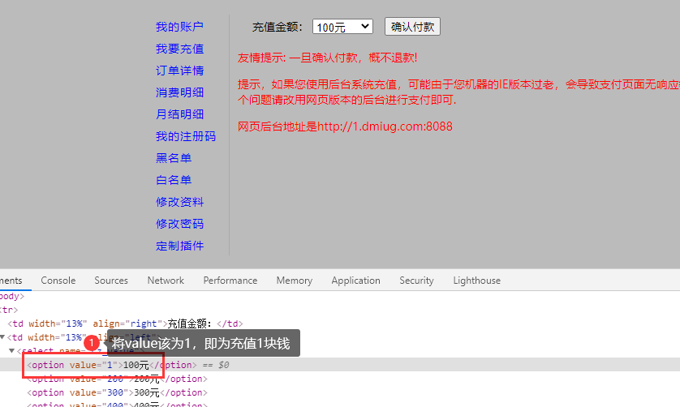

# go-dmsoft
大漠是付费插件，不充值无法使用！

## 安装
`go get -u github.com/qianniancn/go-dmsoft`

## 注意事项
由于大漠插件是win32的Dll，所以在windows64位运行和编译的时候需要设置环境变量。

### 打开终端 Bash
执行 `go env -w GOARCH=386` 或者 `export GOARCH=386`

### Windows Cmd
执行 `set GOARCH=386`

### Goland设置环境

## 大漠自定义充值方法
大漠默认充值最低100元，个人可能用不了那么多，充值太多不划算，所以我们去修改充值金额。

第一步：首先在浏览器打开大漠后台地址`http://main.dmplugin.net:8088/`

第二步：点开我要充值，通过右键审查元素，修改value的值就可以了

## 工具下载
大漠插件(当前最新版本7.2302) [下载地址](http://121.204.253.175:8088/file/dm.rar)

绑定测试工具(v70) [下载地址](http://121.204.253.175:8088/file/%E7%BB%91%E5%AE%9A%E5%B7%A5%E5%85%B7.rar)

免注册DLL(v11) [下载地址](http://121.204.253.175:8088/file/%E5%85%8D%E6%B3%A8%E5%86%8C.rar)

压缩包解压密码是1234. 当前版本号7.2302
